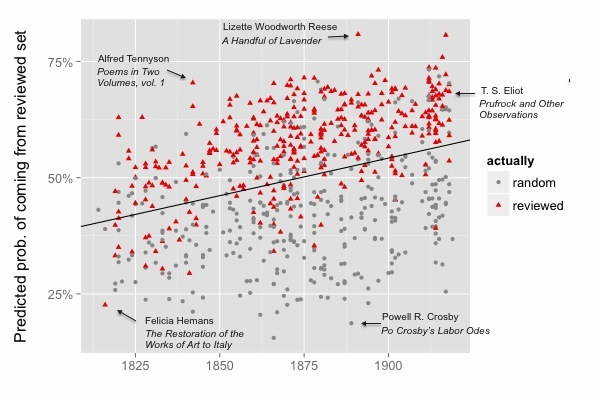
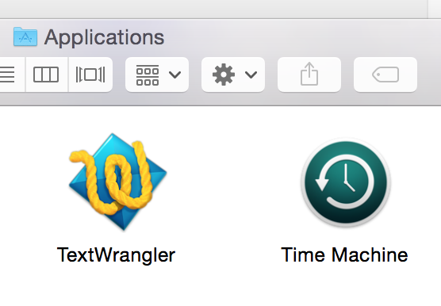
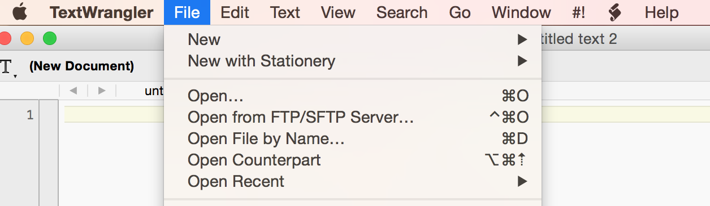
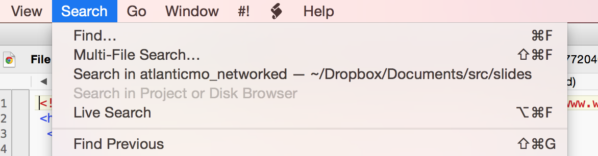
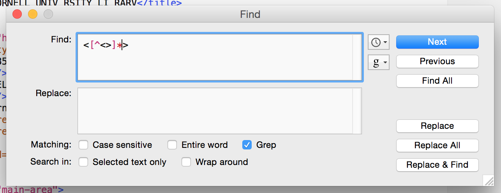
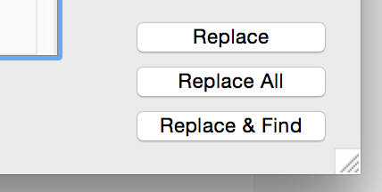
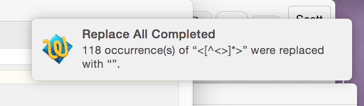
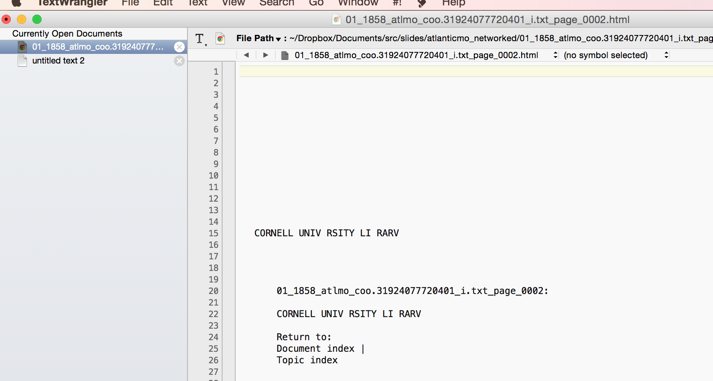

title: Digital Research Tools
author:
    name: Lindsay Van Tine, Mitch Fraas, and Scott Enderle
    email: lindsay.vantine@gmail.com, fraas@pobox.upenn.edu, scott.enderle@gmail.com
theme: senderle/cleaver-sharp
output: index.html
controls: true

--

# Datasets for Text Mining
### Selecting, Scraping, and Cleaning

--

## 

--

### Selecting Data

* Big data is less valuable than **beautiful data**.
* Google used big data to recognize cats.  
* You'll need **crafted data** to recognize something more interesting.

--

### Contrastive Sampling

* Think about concrete **research questions**.
* List the **kinds of texts** that could help answer them.
* Think about **proxy variables** for phenomena of interest.
* Select a subset of texts with many **similarities**.
* Identify precise **differences** among those texts that relate to your proxy variables.
* Conceive an ideal. Then use  **available datasets** to find a compromise.

--

### Underwood and Sellers' [paceofchange](https://github.com/tedunderwood/paceofchange) Corpus

## Contrasting Reviewed and Unreviewed Poetry

## 

--

### Underwood and Sellers' [paceofchange](https://github.com/tedunderwood/paceofchange) Corpus

* **Research Question**: How do the standards governing literary prestige change?
* **Kind of Text**: Historical works of literature charted across time.
* **Proxy Variable**: The existence of reviews in prestigious periodicals (easy to measure) implies prestige (hard to measure).
* **Similarity**:  Focus on works in one genre (books of poetry).
* **Difference**: Divide the set into books of poetry that were reviewed, and books of poetry that were not reviewed.
* **Available Data**: Assume that books randomly drawn from a large pool of data weren't reviewed.

--

### Workflow

* **Three steps**:
    * **Select data** using process described before.
    * **Download data** using HTTrack or wget.
    * **Clean data** using Notepad++ or TextWrangler.

--

### Download data using HTTrack

 * The quick version (to be expanded):
   * **Download and install HTTrack**: https://www.httrack.com/page/2/en/index.html
   * Step through the settings pages **by pressing the "Next" button**; adjust settings when necessary.
   * **Start the download process.** When it's complete, you'll have a set of HTML files.

--

### Clean data using TextWrangler (Mac Only)

 * **Download and install TextWrangler**: http://www.barebones.com/products/textwrangler/download.html 
 * Use TextWrangler's find-and-replace functions to clean up the text.
 * Unlike word, TextWrangler can use **regular expressions.** They are very powerful! For example...

--

### Clean data using TextWrangler (Mac Only)

 * Open TextWrangler, and **load an HTML file**.
   *  
 * Look for the top-level "Search" menu option. **Select "Find"**.
   * 
 * Near the bottom of the "Find" window, select **"Grep"**.
   * 

--

### Clean data using TextWrangler (Mac Only)

 * In the top text field (labeled "Find"), **type "<[^<>]*>"**.
   * 
 * The expression has four parts. It will find every sequence of characters that
   * **<** -- Begins with a '<'.
   * **[^<>]** -- Continues with characters that are neither '<' or '>'.
   * **\*** -- Has zero or more of those characters.
   * **>** -- Ends with a '>'.

--

### Clean data using TextWrangler (Mac Only)

  * Leave the bottom text field (labeled "Replace) empty, and **click the "Replace All" button**.
    *  
  * The rule has found all HTML tags and replaced them!
    *  

--

### More to come on using Notepad++ in Windows, including screenshots. 

