title: Digital Research Tools
author:
    name: Beth Seltzer and Scott Enderle
    email: seltzere@upenn.edu, scott.enderle@gmail.com
theme: senderle/cleaver-sharp
output: index.html
controls: true

--

# Guide to Topic Modeling

--

### Downloading the Topic Modeling Tool

* The Topic Modeling Tool is a graphical interface to MALLET, one of the most widely-used packages for topic modeling.
  * Download the [Topic Modeling Tool Package](https://github.com/senderle/topic-modeling-tool/raw/master/TopicModelingTool.jar). 
     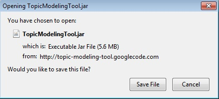 ..or.. 

--

### Downloading the Topic Modeling Tool

* The Topic Modeling Tool is a graphical interface to MALLET, one of the most widely-used packages for topic modeling.
  * Save it to your desktop.  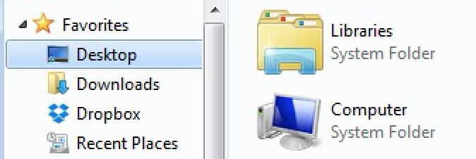 ..or.. 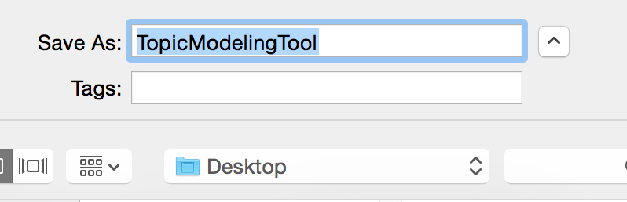

--

### Downloading the Corpus

* We'll be using Beth's [19th-century Detective Fiction](http://senderle.github.io/slides/texttm/data/detective-novels-divided-and-cleaned.zip) corpus.
  * Download the zip file and save it to your desktop.
      ..or..  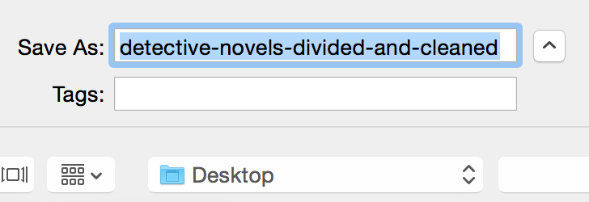

--

### Downloading the Corpus

* We'll be using Beth's [19th-century Detective Fiction](http://senderle.github.io/slides/texttm/data/detective-novels-divided-and-cleaned.zip) corpus.
  * Extract the files into a folder on your desktop.
     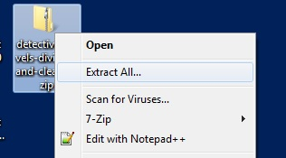 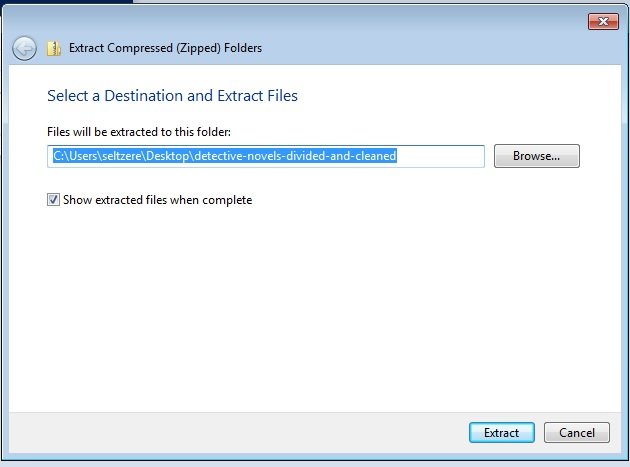 ..or.. 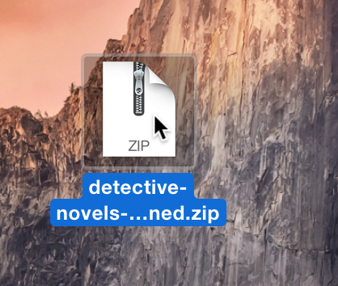

--

### Using the Tool

* Double-click on the app. It should run automatically:  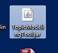

--

### Using the Tool

* Click on the "Select Input File or Dir" button:  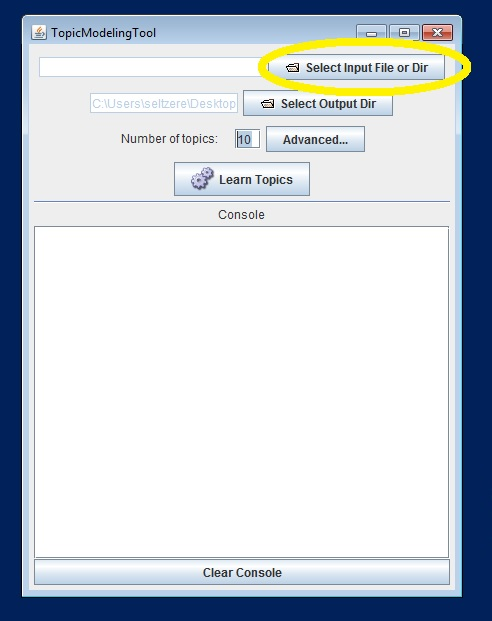

--

### Using the Tool

* Select the "detective-novels-divided-and-cleaned" folder. Then select the "Divided and Cleaned" subfolder:
   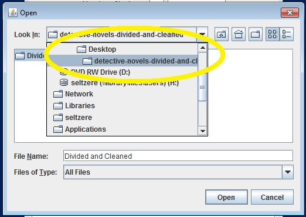 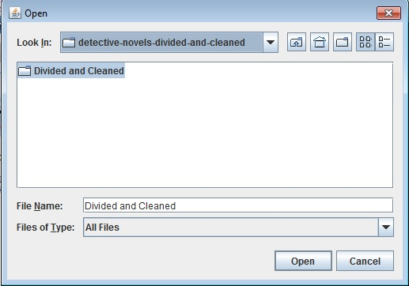

--

### Using the Tool

* Create a new folder to hold the output:
   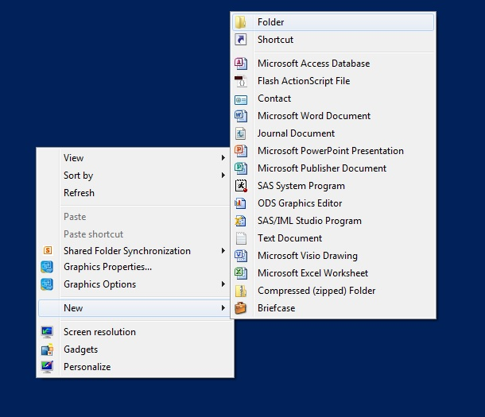 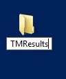

--

### Using the Tool

* Adjust the number of topics and the number of keywords to display: 
   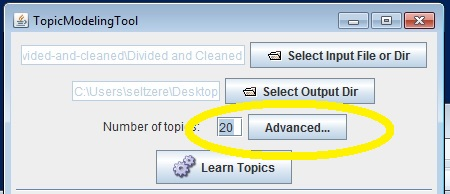 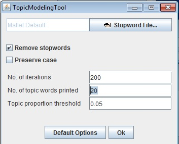

--

### Using the Tool

* Watch it learn!
   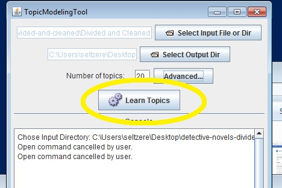

--

### Examining the Output

* Browse the generated HTML files.
  * Open the `TMResults` folder.
  * Open the `output_html` folder.
  * Open `all_topics.html`.

